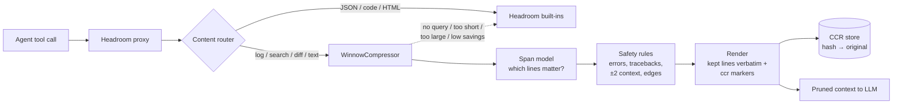

<p align="center">
  
</p>

<h1 align="center">Winnow</h1>

<p align="center">
  <b>Separate the grain from the chaff in your coding agent's tool output.</b><br>
  A task-aware pruner for <a href="https://github.com/headroomlabs-ai/headroom">Headroom</a>, powered by <a href="https://github.com/KRLabsOrg/squeez">Squeez</a> models.
</p>

<p align="center">
  <a href="https://github.com/RecepKurtulus/headroom-winnow/actions/workflows/ci.yml"></a>
  
  
  <a href="https://recepkurtulus.github.io/headroom-winnow/"></a>
</p>

Coding agents spend most of their context on tool output: test runs, builds,
grep hits, logs. Usually only a handful of those lines matter for the agent's
next step. Winnow plugs a small model trained on real agent traces
into Headroom's compression pipeline. It keeps the lines the task needs, never
drops an error or a traceback, and turns everything else into retrievable
markers.

> **41% fewer tokens with 0.85 gold-line recall, zero lost error lines, and
> 0.29 s median latency on a consumer GPU.** At equal compression it keeps
> 15-27 points more of the relevant lines than Headroom's built-in
> `relevance_split`. [Full results →](benchmarks/RESULTS.md)

---

## Example

The agent asks *"Find the build output block that reports the missing
`GetObject` method in the `UserHandler` implementation of
`storage.StorageService`"* and runs `go build ./...`:

<table>
<tr><th>Before: 119 lines, 1,838 tokens</th><th>After: 32 lines, 479 tokens (−74%)</th></tr>
<tr><td>

```text
$ go build ./...
# .../handlers/user_handler.go:23:12: cannot use h
  (type *UserHandler) as type storage.StorageService:
  *UserHandler does not implement storage.StorageService
  (missing GetObject method)
# .../handlers/order_handler.go:45:9: cannot use orderSvc ...
# .../auth/auth.go:12:5: import cycle not allowed
# .../permissions/perm.go:8:2: import cycle not allowed
# .../api/v2/client.go:67:15: undefined: storage.ObjectMetadata
# .../api/v2/client.go:88:20: cannot assign string literal ...
# .../database/migration.go:33:10: cannot find module ...
# .../cache/lru_test.go:78:5: race detector: data race
Read at 0x00c0000a1230 by goroutine 9:
  github.com/example/project/internal/cache.(*LRUCache).Get()
      .../internal/cache/lru.go:44 +0x7c
... 100 more lines of goroutine dumps,
    unrelated packages and test output
```

</td><td>

```text
$ go build ./...
# .../handlers/user_handler.go:23:12: cannot use h
  (type *UserHandler) as type storage.StorageService:
  *UserHandler does not implement storage.StorageService
  (missing GetObject method)
# .../handlers/order_handler.go:45:9: cannot use orderSvc ...
# .../auth/auth.go:12:5: import cycle not allowed
	imports github.com/example/project/internal/permissions
<<ccr:e2e73bc3f2f290a77efc7426 52_lines_offloaded>>
--- FAIL: TestUserHandler_Get (0.00s)
    user_handler_test.go:45:
        Error:        Not equal:
                        expected: &storage.Object{...}
                        actual  : <nil>
FAIL
exit status 1
<<ccr:0bac82ae58f9e3ba08a67445 15_lines_offloaded>>
--- FAIL: TestConcurrentAccess (0.01s)
        panic: runtime error: invalid memory address ...
FAIL
exit status 1
<<ccr:407242e9f3f948833f58dd56 23_lines_offloaded>>
...
```

</td></tr>
</table>

The block the agent asked for is kept verbatim, every failure line survives,
and each `<<ccr:…>>` marker can be expanded through Headroom's retrieval tool if
the agent needs the dropped lines after all. (Real model output on an example
from the Squeez test set; long paths and lines shortened to fit.)

## How it works



1. **Gate.** Blocks without a task query, under 40 lines, over the device's token
   budget, or where pruning would save less than 20% pass through untouched, so
   Headroom's own compressors handle them.
2. **Score.** A span model reads the task query and the whole output and marks
   the lines that matter for the next step.
3. **Protect.** Lines with errors, failures, exit codes, panics or pytest `E`
   details are always kept, as are whole Python tracebacks, two neighbours of
   every kept line, and the first and last two lines.
4. **Render.** Kept lines stay byte-identical. Each dropped run becomes one
   `<<ccr:HASH N_lines_offloaded>>` marker whose original text goes into the
   CCR store. Hashes are deterministic, so identical input yields identical
   output and prompt caches stay warm.

The plugin never raises. Any failure (missing torch, model download error,
inference error) falls back to Headroom's own path.

## Installation

```bash
pip install "headroom-winnow[model] @ git+https://github.com/RecepKurtulus/headroom-winnow"
```

Installing changes nothing until you opt in:

```python
from headroom.transforms.content_router import ContentRouter, ContentRouterConfig

router = ContentRouter(ContentRouterConfig(active_external_compressors=["winnow"]))
```

or start the proxy with `--compressor winnow`.

### Choosing a model

| Backend | Model | Size | When to use |
|---|---|---|---|
| `pooled` (recommended) | 32M line classifier trained with [`training/`](training/) | 121 MB | Fast enough to score any output on a GPU |
| `highlighter` (default) | [`KRLabsOrg/verbatim-rag-modern-bert-v2`](https://huggingface.co/KRLabsOrg/verbatim-rag-modern-bert-v2) | 600 MB | Works out of the box, downloaded from the Hub; limited to short outputs |

To use the pooled model, download `squeez_pooled_ettin32m.zip` from the
[latest release](https://github.com/RecepKurtulus/headroom-winnow/releases),
unzip it, and point the plugin at it:

```bash
export HEADROOM_WINNOW_BACKEND=pooled
export HEADROOM_WINNOW_MODEL=/path/to/squeez_pooled_ettin32m
```

### Configuration

| Variable | Default | Meaning |
|---|---|---|
| `HEADROOM_WINNOW_BACKEND` | `highlighter` | `highlighter` or `pooled` |
| `HEADROOM_WINNOW_MODEL` | `KRLabsOrg/verbatim-rag-modern-bert-v2` | Hub id or local path; required for `pooled` |
| `HEADROOM_WINNOW_REVISION` | pinned commit of the default model | Model revision |
| `HEADROOM_WINNOW_DEVICE` | `auto` | `auto` (CUDA if available), `cuda` or `cpu` |
| `HEADROOM_WINNOW_DTYPE` | `float32` | `float16` is faster only on GPUs with tensor cores |
| `HEADROOM_WINNOW_MAX_TOKENS` | per backend and device | Largest output the model scores; larger ones go to Headroom |

A GPU is strongly recommended. On CPU the plugin only scores short outputs.

## Results

On the 618-example test split of the Squeez dataset:

| Method | Recall | Token reduction | Error lines lost | p50 latency |
|---|---|---|---|---|
| Headroom `relevance_split` (BM25) | 0.725 | 58.6%¹ | 7,953 | 1 ms |
| Headroom `relevance_split` (hybrid) | 0.753 | 57.6%¹ | 7,771 | 2.2 s |
| **Winnow (32M pooled)** | **0.847** | **41.4%** | **0** | **0.29 s** |

¹ Upper bound: the dropped tail is Kompressed inside Headroom, not removed.

At equal compression (50 / 70 / 90% of lines dropped) the pooled model keeps
0.89 / 0.84 / 0.68 of the gold lines, against 0.73 / 0.63 / 0.46 for
`relevance_split`. Details, the 150M highlighter numbers and reproduction
commands are in [`benchmarks/RESULTS.md`](benchmarks/RESULTS.md).

## Training your own model

[`training/kaggle_train_pooled.ipynb`](training/kaggle_train_pooled.ipynb)
trains the 32M pooled classifier on a free Kaggle T4 in about six hours. It
uses [Squeez](https://github.com/KRLabsOrg/squeez)'s own training code at a
pinned commit and evaluates on the same test split as the benchmark. Swap
`--base-model` to try other encoders.

## Project layout

```
headroom_winnow/
  compressor.py    WinnowCompressor: the headroom.compressor contract, gates, fail-open
  selection.py     spans → lines, safety rules, rendering with markers
  markers.py       CCR marker format and deterministic hashes
  backends.py      highlighter and pooled backends: lazy, pinned, device-aware
benchmarks/        compare.py and RESULTS.md
training/          Kaggle notebook for the pooled model
upstream/          patch proposed to Headroom (see below)
tests/             unit tests with a fake model, router end-to-end, real-model tests
```

## Limitations

- **Headroom's lossless fold runs first.** Headroom applies its byte-exact fold
  (and, for logs and search results, `relevance_split`) before the external
  compressor hook and returns early when either succeeds, so such blocks never
  reach this plugin. See `tests/test_router.py::test_known_gap_lossless_fold_preempts_external`.
- **Passthroughs skip Headroom's compressors in 0.39.1.** When the plugin
  declines a block, the router still adopts the unchanged block. The one-line
  fix is in [`upstream/router-respect-passthrough.patch`](upstream/router-respect-passthrough.patch);
  the matching test is a strict `xfail` until it lands.

## Development

```bash
pip install -e ".[dev,model]"
ruff check . && ruff format --check . && mypy headroom_winnow tests benchmarks
pytest               # fast tests, no downloads
pytest -m slow       # downloads and runs the real highlighter
```

## Acknowledgements

- [Headroom](https://github.com/headroomlabs-ai/headroom) for the proxy, CCR
  store and the external compressor contract this plugin implements.
- [Squeez](https://github.com/KRLabsOrg/squeez) by KRLabs for the task-conditioned
  pruning approach, the training code, the highlighter model and the dataset.
- [Ettin](https://huggingface.co/jhu-clsp/ettin-encoder-32m) for the 32M encoder
  the pooled model is fine-tuned from.

## License

Apache-2.0. See [`LICENSE`](LICENSE) and [`NOTICE`](NOTICE).
