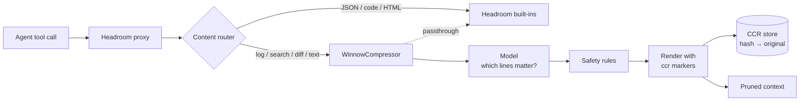

# How it works

Winnow sits at one point inside Headroom and touches nothing else. The content
router calls it only when you selected it and the block's detected content type
is one it declares.



## 1. Gate

Winnow returns the block untouched (`compressed=False`) without calling the
model when:

- there is **no task query**: without knowing the task there is no basis for
  relevance;
- the block is **under 40 lines**: markers would cost more than they save;
- the block is **over the token budget** for this backend and device;
- the backend **failed to load**: one warning, then passthrough for the rest of
  the process.

## 2. Score

The model reads the task query (Headroom passes the user's request plus the
triggering tool call's arguments, such as the grep pattern or file path)
together with the **whole** output, and marks what matters for the next step.
The pooled model scores each line; the highlighter marks character spans that
are mapped to the lines they touch.

!!! info "Why not split long outputs into chunks?"
    The model needs the whole output in view. Cutting the highlighter's window
    from 8,192 to 512 tokens made it 20× faster but more than halved recall at
    high compression. Winnow keeps full context and uses a smaller model for
    speed instead.

## 3. Protect

Whatever the model says, these lines are always kept:

- lines containing `error`, `failed`, `traceback`, `panic`, `exception`,
  `exit code`, `exit status` or `fatal` (case-insensitive);
- pytest assertion details (`E   ...`);
- every Python traceback in full: header, frames and the exception line;
- two neighbours on each side of every kept line;
- the first and last two lines (command banner and summary).

If the model finds nothing relevant, or pruning would save less than 20%,
Winnow passes the block through instead of pruning on a weak signal.

## 4. Render

Kept lines stay **byte-identical**: the output is split on `\n` only, with line
endings preserved. Each maximal run of dropped lines becomes one marker:

```text
  File "app/views.py", line 88, in login
<<ccr:3f2ec81ea3e4ce24a1b2c3d4 132_lines_offloaded>>
AssertionError: expected 302, got 500
```

The hash is the first 24 hex characters of the dropped text's SHA-256, the same
rule Headroom uses. The `hash → original` map goes back in
`CompressOutput.recoverable`, and the router stores it in Headroom's CCR store,
so the agent's retrieval tool can expand any marker. A run shorter than its
own marker is kept instead.

Because hashing is deterministic, identical input always produces identical
output, which keeps the provider's prompt cache warm across turns.

## Failure handling

`compress()` never raises. Every failure (missing torch, download error,
inference error, unexpected model output) turns into a passthrough, and the
request continues on Headroom's own path.
